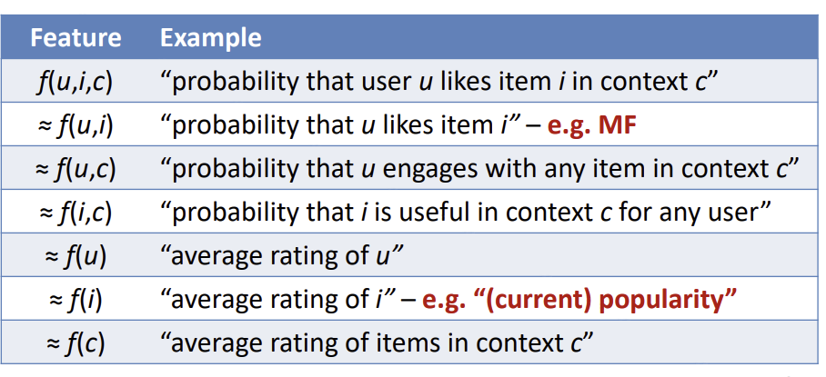

# Hybrid Recommender Systems

---

Lets combine more than 1 system!

---

approaches can be broken down into three major categories:

- monolithic
- parallellised 
- pipelined

---

## Monolithic approaches

- feature combination
	- combine features of one model in the training of another
	- e.g. add keyword features to ratings matrix
	- traditional MF can be augmented with this
- side information
	- same idea; but acknowledge that the information is fundamentally different
	- used to augment the model again (e.g. like regularisation)
	- could e.g. ensure that users are similar to their friends

---

## Parallelised hybridisation

- mixed recommendation
	- just do both
	- present results side by side
- weighted
	- $\text{rec} (u, i) = \sum_{k=1}^n \beta_k \times \text{rec}_k(u, i)$
	- if $\forall k . \beta_k = 1$ this is combsum
	- other fusion methods exist (e.g. borda fuze)
- switching
	- special case of weighted combination; all but one value of $\beta$ is $0$
	- so we just use one system
	- example -> use CF when we have enough reviews, default to content-based recs 

---

## Pipelined Hybridisation

Cascade:
successors recommendations restricted by predecessor
Essentially, we have a 'pick then rank' system.

Very common architecture
-> youtube works like this

---

## Problem: How do we tune our hybrid models?

---

## Answer: Machine learning

----
### Learn to Rank

- actively researched for search engines / IR
- its hard
	- limited training data
	- poor ML techniques
	- too few features to show value
- no silver bullet -> different scenarios require different approaches
- We can combine many features -> CF, CB, KB systems

---

---
### LTR is:
- typically  a cascade architecture
	- first step is generating a set of $k'$ candidates
- but also parallel
	- additional features can be computed at the same time

---

## LTR - details

The goal is to lean a ranking function
$$h : X \rightarrow Y$$
That minimises some loss function 
$$\Delta : h(X) \times Y \rightarrow \mathbb{R}$$
where:
- $X$ is our input space
- $Y$ is our output space
- $h$  is our hypothesis function -> what we are trying to learn
- $\Delta$ is our loss function

---

### Input space ($X$)

LTR takes feature vectors as input, $x \in X$.
each vector $x$ represents a ranking item:
$$x_k = f(u,i,c) : U \times I \times C \rightarrow \mathbb{R}$$
where we have 
$u$ is a user
$i$ is an item
$c$ is context e.g. 
- keyword query
- constraints
- environmental variables

---

### Features

There are many possible features we could choose to include
we need to do some feature engineering to figure out the best ones

---

### Output Space ($Y$)

LTR can predict more than one thing at once
Each item in an output represents one thing e.g.
- a rating
- click y/n
- purchase y/n
- other labels
- etc.

---

### Ranking inconsistency

Perfect ranking is not possible
1. Models have limited expressive power -> cannot learn a perfect model
2. users change their mind all the time for no reason
3. different users like different things -> ranking not always generalisable

---

### Labelling

- Given a user context pair...
- how do we figure out the relevance of an item?

Three options:
- label individual items 
	- e.g. with 'relevant', 'not-relevant', 'partially-relevant'
	- can use ratings as a proxy!
- labelling ordered pairs
	- e.g. A < B; B < C, X < Z
	- can be derived from implicit data
- creation of a list
	- ideal, but hard to do.

---

### Implicit data

very common & very cheap
- lots of unary data (e.g. click or not)
- some non-unary data (e.g. click vs saw but skipped)
Mostly positive signals, so how do we learn what not to do?

- record negative feedback
- simulate graded feedback
- negative sampling?

---

### Hypothesis space $H$

The goal is to construct a ranking function
$$h: X \rightarrow Y$$
our hypothesis could be any function $h \in H$

$h$ couldbe a linear function:
$$h(x) 
= \langle w, x \rangle 
= \sum_{k=0}^K w_k x_k
$$
---

$h$ could be a tree-based function:

$$
h(x)
= \sum_j b_j \mathbb{I} (x \in R_j)
$$
where:
- $j$ is a leaf in the tree
- $b_j$ is the value predicted in a region $R_j$ -> i.e what the leaf predicts
- $\mathbb{I}$ is the indicator function -> i.e. true if $x$ is on this leaf, false otherwise

We might have a forest of such trees (and take an average, or combine somehow etc.)

---

$h$ could be some neural network thing

- the point is, there are infinitely many options for $h$
- a leaner must find the best one - the one with the lowest loss

---

### Loss Function ($\Delta$)
loss = measure of how good our model is
i.e. a measure of its error 

many options:
- 0-1 loss
- absolute loss
- square loss

---
## Loss Function Families
---
### Pointwise approaches

- reduce ranking to regression or classification
- "predict this label"
- ASSUMES relevance is user independent -> false assumption
- even relevance of features is user dependent
- 
so bad for learning personalisation

---

### Pairwise approaches

reduce ranking to classification on item pairs w.r.t. the same qeury
-> no longer need user independence

but:
- number of instance pairs varies across user requests
- importance of error varies across rank
	- gotta get first pair right (very important)
	- is the 10th and 11th item order as important?

---

### Listwise approaches

perform learning directly on document lists

two major approaches:
- directly optimise IR metrics like MRR, NDCG, MAP
	- tricky - IR metrics are not smooth
- define a listwise loss which is smooth and differentiable

---

### CLiMF
> Collaborative Less-is-More Filtering

Idea: lets hack Reciprocal Rank (a bumpy function) so that its smooth

$$RR = \sum_{j\in\ \text{items}} \frac{\text{rel}(j)}{\text{rank}(j)} \prod_{k \in \ \text{items}} (1-\text{rel}(k) \times \mathbb I (R_k < R_j) )$$

---
### CLiMF

the bumpiness in this function comes from 2 places:
$$
\begin{gather}
\frac 1 {\text{rank}(j)}\\ 
\text{\&}\\
\mathbb I (R_k < R_j)
\end{gather}
$$

Can we approximate these?

---
### CLiMF

Let $g$ be the logistic function;
then we can approximate the bumpy parts with scores:

$$
\begin{align*}
\frac 1 {\text{rank}(j)}  &\approx g(f_j)\\
\\
\mathbb I (R_k < R_j) &\approx g(f_k - f_j)
\end{align*}
$$

But these are smooth!

---
### CLiMF

So we have an approximation for $RR$ which we can differentiate 

$$
RR = \sum_{j\in\ \text{items}} {\text{rel}(j)}g(f_j) \prod_{k \in \ \text{items}} (1-\text{rel}(k) \times g(f_k - f_j) )
$$
We can then use e.g. gradient descent to optimse!

--- 

## Many other similar hacks exist for other metrics

