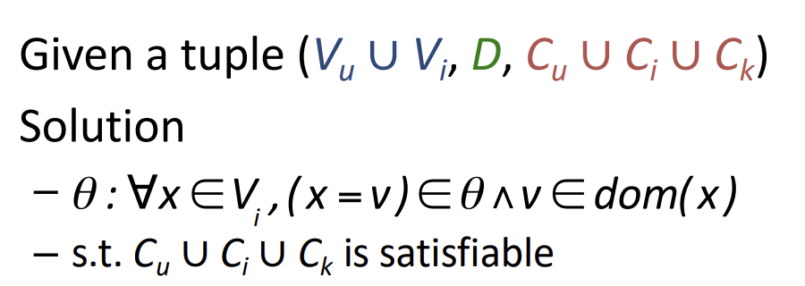
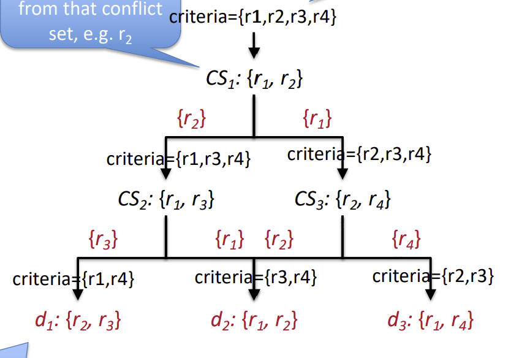

<style> *{ font-family: 'FiraCode NF'; } </style>

# Constraint Recommendation

---

## Constraints

Sometimes users have explicit requirements:
- cheaper than \$$x$
- green
- 'durable'
- waterproof

Knowledge based recommendation:
> Tell me what fits my needs
 

---

## Iterative Recommendation

- users specify requirements
- system produces recommendations
- users refine requirements
- repeat

This interaction can take several forms:
- conversations
- search interactions
- navigation - we'll see this more later
 
---

### Knowledge Models

- Obviously, to do this we need knowledge about our items
- this is called a knowledge model
- its basically just a database
	- has tables etc.
I hope you remember relational algebra!

---

### Relational algebra recap

A relation $R$ (a table) has rows and named columns

We have 2 operators:

---
### Select ($\sigma$)

$$
\text{Locals} = \sigma_{\text{city}=\text{glasgow}} \ \text{People}
$$
```sql
SELECT * FROM people
WHERE city = "glasgow"
```

---

### Project ($\pi$)

$$
\text{names \& ages} = \pi _{\text{name},\ \text{age}} \ \text{People}
$$
```sql
SELECT name, age FROM people
```

---

### We can of course combine these operators to do whatever we like...

---

### Constraints

We can specify constraints:

- "Camera should cost less than $200"
- "camera should be suitable for sports" => video=yes, waterproof=yes 
	- note here we use our knowledge base to turn 'sporty' into useful constraints

This is a constraint satisfaction problem

---

## Constraint Satisfaction

A CSP is a triple:
- $V$ a set of variables
- $D$ the domains of those variables
- $C$ a set of constraints

---

### KB constraints as a CSP:

We have a tuple:
$$
(V_u \cup V_i\ ,\ D\ ,\ C_u \cup C_i \cup C_k)
$$

---

## Variables:
$$V_u \cup V_i$$

User requirements ($V_u$) + item properties ($V_i$)


---

## constraints:
$$
C_u \cup C_i \cup C_k$$
$C_u$ -> Constraints on requirements 
- e.g. max price cannot be more than the most expensive camera

$C_i$ ->Constraints on properties 
- e.g. camera A (and its properties) or camera B or camera C... 
- cannot have battery life of A and focal length of B -> no mixing and matching!

$C_k$ -> requirement-property links
- 'water sporty' -> waterproof = yes
- how to translate requirements into constraints on properties

---
### Solutions

A solution is a set of items

If we can't find a solution, we should ask users to relax a constraint until we can find one.

---

### Conjunctive Querying

- Instead of solving a CSP...
- lets just query a database
- we can write our constraints as a relational algebra expression:

$$
\text{Candidates} = \sigma_{[criteria]}\ \text{Products}
$$
where $\text{criteria}$ is:
$$
\text{criteria} = \text{constraint}_1 \wedge\text{constraint}_2 \wedge...\wedge \text{constraint}_n
$$

---

## Specifying constraints

users can specify all constraints at once, in a wizard-style input
-> then presented with results and an opportunity to revise constraints

Sometimes, there are too many options for this to work
instead we provide defaults
- they can be static (e.g. max-price = $300)
- or dependent (e.g. waterpoof = no IF max-price < 200)
- or derived (e.g. usage <- previous values)

most users wont specify everything, so we should identify interesting properties

---
### I can't get no satisfaction

What if no solution can be found?
- we need to relax the constraints until a solution is found
- first identify conflicting requirements (i.e. nothing can be found that satisfies all of these)
	- called a diagnosis
- then use this to suggest a 'repair' -> a relaxation of constraints


---

- find the conflict sets
- calculate diagnoses
- repair constraints based on diagnoses

---



---

### Repair from diagnosis

- In the previous example, we have 3 diagnoses
	- each with an associated new criteria
	- lets call the diagnosis $d_n$ and its associated set of criteria $c_n$
- how do we use them to repair constraints?

$$
\text{repair} = \pi _{[\text{attr}(d_n)]} \sigma _{c_n} (\text{Products})
$$

---
### In other words:

```sql
SELECT <attributes in the diagnosis> FROM products
WHERE <criteria in the associated cirteria>
```

We can now present the user with something in the form "we can satisfy \<some criteria> if you accept \<some repair to the constraints>"

> We  can get price < 500 if you accept waterproof = false

---

### conversational Recommendation
- you chat to the bot and the bot tells you what to buy
- exampels include 
	- siri
	- alexa
	- literally any of those chat assistants
Problem: requires domain identification
-> dont recommend cameras if you are looking for places to eat!

---
### domains
We define a set of 'ontologies'
-> schemas / groups of products
e.g. restaurants, cameras, movies etc.

when we talk to the bot, it classifies our recommendation request 
We then have a predefined set of actions we can perform in the domain

e.g. find a good eating place -> find a restaurant with ratings at least good.

---

### Personalisation
We can build up a history of interactions to help personalise this
can build up knowledge of the user:
- preferred price range
- preferred style of restaurant
- places you have been before

---

# Break time

---
# Case Based Recommendation

---
### Problem:

- Users are lazy
- They do not want to have to specify all the constraints at once
-> because it is annoying

Alteratively:
- users may not understand all the features
	- e.g. do any of us really understand what focal length means for a camera?
- features might be interdependent


Can we help them get around this?

---
### Case Based Reasoning

> A case-based reasoner solves a new problem by adapting a solution from an old problem

4 steps:
1. retrieve an initial case
2. reuse the retrieved case as a first guess
3. revise the current case if its wrong until
4. retain the case when its right.

---

### Case Based Reasoning

Given:
- an input case
- some critqiues (e.g. "cheaper")

return:
- similar cases (i.e. similar items) that satisfy the new requirement

---

### Critiques

- A critique is a change request
- it specifies some constraint that the current case does not match e.g. 
	- cheaper
	- nearer the sea
	- more modern looking
	- water-proof

---

### Static Critiquing 

```python
def staticCritique (query, items) {
	while (query) {	
		item = recommend(query, items)
		query = review(item, items)
	}
}

def recommend(query, items) {
	candidates = [item for item in items | item satisfies query]
	return nearestNeighbour(items, query)
}

def review(item, Items) {
	query = critique(item)
	items.remove(item)
	return query
}
```

---

### Simple vs Compound critiques

Simple critiques are direct and about 1 attribute
- e.g. cheaper = lower price

but we could also have a more complex critique
- e.g. better value = lower price <and/or> higher quality
- or the user might just provide two instructions

---


### Dynamic critiquing

Asking the user to provide all the critiques at once may cause 'stress'
So instead we ask for one critique per cycle, iteratively.
-> demonstrate value, helps keep cognitive energy high (SUGE)

dynamic critiques are derived on the fly

inferred from remaining items
e.g. 42% of remaining cameras have better zoom and lower price

We can derive compound critiques from association rules!

---

