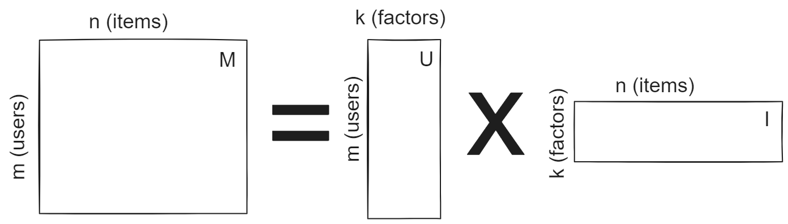

# Matrix Factorisation (MF)

---

## Problems with Collaborative Filtering

---

### Problems with CF

To do CF:
- We need to work out the neighbourhood
- So we need to look into our huge user-item-preference matrix
- HUGE storage cost

Can we shrink this down?
-> this is the key thing MF tries to solve

---

### Matrix Factorisation: Key Idea

Lets say we have an $m \times n$ matrix $M$ - i.e. one with $m$ users and $n$ items

We can write this matrix as the product of two others:
$$M = U I$$

---
$U$ is our user matrix
$I$ is our item matrix
We then pick a number $k$ to be the number of *factors* we want to consider:

$U$ and $I$ together are smaller than $M$ [1]

Thus, its a kind of *dimensionality reduction*

[1] so long as if $k (m+n) < mn$ 

---
## Result Quality

- $U$ and $I$ are smaller than $M$
	 $\therefore$ their product $UI$ only *approximates* $M$ 
- However
	- we can get better approximations with higher values of $k$
	- You can get very good results with a surprisingly small $k$
-> as little as $k=40$ is still world-class.

---

### Predictions

We can be lazy about our predictions too
we dont have to compute all of $M$;
Instead we can work out a single entry;
the rating $r$ for a user $a$ and an item $p$ is given by:

$$
\begin{align*}
r_{ap} =&\ \bar{r_a} + \frac{\sum_{b\in N}\ \text{sim} (a, b) \times (r_{bp} - \bar{r_b})}{\sum_{b\in N}\text{sim}(a,b)}\\
\approx& \ U_a I_p
\end{align*}
$$
In other words - we can multiply the row representing $a$ and the column representing $p$.

---
### N.B.

By convention, we say that $M = U I^\intercal$
i.e. the transpose of $I$. 
I have used different names for the matrices $U$ and $I$ 
-> (because $U$ser and $I$tem is easier to remember)
Craig users $U$ and $V$ (in that order)

... Because SVD has 3 matrices $U$, $D$ and $V$ - but it doesn't really matter.

---
## OK, but how do we do this?

---
### Doing MF
- How do we create the matrices $U$ & $I$? 
- Many approaches
	- Techniques based on Eigenvalues (SVD)
	- Techniques based on Linear Systems (LU)
- We will look at SVD

---

### SVD
#### -> Singular Value Decomposition

---
An $n \times m$ matrix $R$ can be re-written perfectly as the product of three other matrices:

$$ R = U D V^\intercal$$

---

We can truncate the SVD to use a $k \times k$ matrix $D$

And in fact we can even ignore $D$ - letting the factors within become part of $U$ and $V$. Thus, we get to our original matrix form.

--- 
## SVD pros
- Predictions may be higher quality
	- noisy ratings filtered out
	- can detect nontrivial correlations
	
---
### SVD Cons
- predictions can be less accurate
	- yes it can go both ways
	- depends on the target domain
- lack of transparency
	- how did we get these numbers? who knows....
- Hard 
	- $O(m^2 n + n^3)$ time

---
### Missing values

SVD is undefined for incomplete matrices
	-> this is a very big problem for us (with missing numbers all over the place)
Strategies to handle it:
- impure (assume they are a mean)
- normalise (assume they are 0)
- ignore!

---
## SVD/MF as a Machine learning goal

---

We want to find $U$ and $I$ such that  $R = U I^\intercal$
and the error $e = r_{ap} - \hat{r}_{ap}$ is minimised.
$$
\begin{align*}
\mathcal{L} = \sum_{(a,p)\in\ A \times P} \left(r_{ap} - U_a (I_p)^\intercal \right)^2 && \text{where $r_{ap}$ is known}
\end{align*}
$$
Note: What kind of loss is this?

so our optimisation problem is:
$$

\DeclareMathOperator*{\argmax}{arg\,max}
\DeclareMathOperator*{\argmin}{arg\,min}

\begin{align*}
\argmin_{U, V} \sum_{(a,p)\in\ A \times P} \left(r_{ap} - U_a (I_p)^\intercal \right)^2 && \text{where $r_{ap}$ is known}
\end{align*}
$$

---

## Problem: Overfitting
> Data is sparse, so we learn too much noise

---
## Solution: Regularisation

---
### Regularisation
> “Any modification we make to a learning algorithm that is intended to reduce its generalisation error but not its training error.”

In our case, we want to penalise big weights (which indicate heavy learning)

So we modify our optimisation:
$$
\begin{align*}
\argmin_{U, V} \sum_{(a,p)\in\ A \times P} \left(r_{ap} - U_a (I_p)^\intercal \right)^2 
+ \lambda (|U_a|^2 +|I_p|^2)
&& \text{where $r_{ap}$ is known}
\end{align*}
$$
---

# Breakdown:
$$\lambda (|U_a|^2 +|I_p|^2)$$
- take the length of the embedding of $a$
- square it
- take the length of the embedding of $p$
- square it
- add them together
- scale this by our regularisation parameter $\lambda$

---

## Bias terms:
- We can also add in bias
- similar to mean-centre normalisatoin

the old version:
$$r_{ap} = U_a I_p$$
The new version:
$$r_{ap} = U_a  I_p + b + b_u + b_i$$
factor in:
global bias ($b$)
user bias ($b_u$)
item bias ($b_i$)

---

## Solving MF
- we can use coordinate descent 
	- update one param at a time
- or gradient descent
	- update many at once

---
## Gradient descent
General form of gradient descent is:
$$
x_{i+1} = x_i - \gamma \nabla F(x_i)
$$

- $\gamma$ is the learning rate -> a hyper parameter
	- higher = faster, lower = more accurate
- $\nabla F(x)$ is the gradient of the function we are trying to optimise ($F$)

> Nothing new, I hope?

---

---
## Stochastic Gradient Descent

Stochastic = Random
Idea: dont use all the data
choose a sample
this randomness acutally speeds up convergence!

---

### Latent Factors
Each user or item can be described by $k$ latent factors/features/attributes
We don't necessarily know what they mean - the machine learns them.

This makes them a kind of embedding - we are *embedding* each item/user into a vector of $k$ dimensions

Similar items should have similar embeddings - so we can use them to get similarity scores

---
## Problems
the key assumption is that we can predict a rating by combining the user and item factors
- which can be limiting -> no way to easily encorportae other data

deep learning offers a solution - we can do some crazy stuff

---

### Implicit feedback 

With implict feedback, we dont really care about scores or rating...

We want to rank items - so we can select what to reccommend next to the user.

--- 
## unknown as negative

- With implicit feedback, we have (probably) positive signals, and that's it
- missing places are a mix of negative signals and missing values
- we can assume that all these unknown are negative...
- ... but this gives terrible results with MF
- How do we do better?

---

### Bayesian Pairwise Ranking
- Think about pairs of items
- try to correctly rank a given pair
> KEY: this only works for ranking tasks

If a user clicks on an item
we assume they prefer that item over all other non-observed items;

using ranks instead of scores gives us power!

---

---

# We can use BPR to update an existing MF model
# So that it handles Implicit data better

we rank based on the scores we got from 'ratings' prediction

